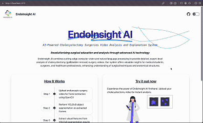
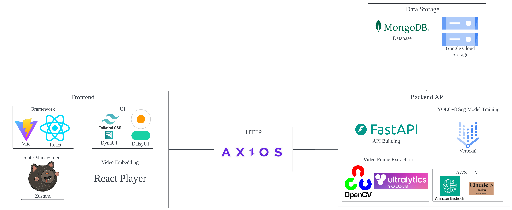

# EndoInsight AI



**AI-Powered Cholecystectomy Surgeries Video Analysis and Explanation System**

*Revolutionizing surgical education and analysis through advanced AI technology*

EndoInsight AI combines cutting-edge computer vision and natural language processing to provide detailed, expert-level analysis of cholecystectomy (gallbladder removal) surgery videos. Our system offers valuable insights for medical students, surgeons, and healthcare professionals, enhancing understanding of surgical techniques and anatomical structures.

[Demo Youtube Video](https://youtu.be/YkT4XBxaPaw?si=zE0TbRUs2vREY4zU)

## Tech Stack



### Backend

- [Python](https://www.python.org/?downloads) 3.10

- [FastAPI](https://fastapi.tiangolo.com/): Web framework for building APIs

- [MongoDB](https://www.mongodb.com/docs/manual/administration/install-community/): NoSQL DB to store the processed output

- [OpenCV](https://opencv.org/): For video processing and frame extraction

- [YOLOv8 Segmentation](https://docs.ultralytics.com/tasks/segment/): For object segmentation

- [Amazon Bedrock Claude 3 Haiku](https://aws.amazon.com/blogs/aws/anthropics-claude-3-haiku-model-is-now-available-in-amazon-bedrock/): For textual explanation generation

- [Google Cloud Storage (GCS)](https://cloud.google.com/storage/docs/buckets): For storing processed videos
  
- [Vertex AI](https://cloud.google.com/vertex-ai/docs/start/introduction-unified-platform): For YOLOv8 object segmentation model training

- [CholecSeg8k Dataset](https://www.kaggle.com/datasets/newslab/cholecseg8k): The endoscopic images dataset used for model training

### Frontend

- [React Vite](https://vitejs.dev/guide/): For building the user interface
  
- [Zustand](https://zustand.docs.pmnd.rs/getting-started/introduction): For State Management

- [Axios](https://axios-http.com/docs/intro): For making HTTP requests to the backend

- [DaisyUI](https://daisyui.com/): For UI components and styling
  
- [Tailwind CSS](https://tailwindcss.com/docs/installation): For utility-first CSS

- [DynaUI](https://www.dynaui.design/animated-drawing-text): For Text Animation

- [React Player](https://github.com/cookpete/react-player): For video embedding

## Features

### 1. Video Ingestion & Frame Extraction

- Description: Load endoscopic video files and extract key frames for further analysis.

### 2. Visual Feature Extraction by Object Segmentation with YOLOv8

- Description: Analyze each frame using YOLOv8 to perform object segmentation, identifying the classes of objects in the endoscopic images.

### 3. Visual Feature Extraction

- Description: Extract relevant features from the YOLOv8 segmentation results, including object locations, sizes, and classifications.

### 4. Textual Explanation Generation

- Description: Generate detailed textual explanations of the medical images based on the YOLOv8 segmentation results and extracted features.

### 5. Multimodal Integration

- Description: Combine visual segmentation data and generated textual explanations to produce a contextually rich output that reflects both the visual content and the corresponding text.

### 6. Result Visualization

- Description: Generate a final output that presents the original image, YOLOv8 segmentation results, and textual explanations in an integrated format.

### 7. User Interface (UI)

- Description: Develop a simple web interface for uploading images, running analyses, and viewing the integrated image-text output. Users should be able to interact with both the image and the generated text.

## Contributing

All type of contributions are welcome. You may contribute by reporting bugs, suggesting new features, translating the extension or even by submitting a pull request.

## Project Setup (How to run the program)

```bash
git clone https://github.com/shaunliew/endoinsight-ai.git
```

## Frontend Setup

```bash
cd <path_to_cloned_repo>/endoinsight-ai/frontend

npm install

npm run dev
```

```bash
VITE v5.4.3  ready in 277 ms

  ➜  Local:   http://localhost:5173/
  ➜  Network: use --host to expose
  ➜  press h + enter to show help
```

access the `http://localhost:5173/`

## Backend Setup

### Setup GCP Credentials

get service account JSON from GCP Project in order to use GCP Service. Make sure to store it into the repo and run the command below before runs the backend python code.

```bash
export GOOGLE_APPLICATION_CREDENTIALS="credential.json"
```

### Run the FastAPI backend

```bash
cd <path_to_cloned_repo>/endoinsight-ai

python -m venv venv

source venv/bin/activate

pip install -r requirements.txt

python main.py
```

```bash
python main.py
INFO:     Started server process [61941]
INFO:     Waiting for application startup.
INFO:     Application startup complete.
INFO:     Uvicorn running on http://0.0.0.0:8000 (Press CTRL+C to quit)
```

access the `http://0.0.0.0:8000`

### Connect GCS to Vertex AI for model training (optional)

```bash
MY_BUCKET=<own_bucket_name>
cd ~/
gcsfuse --implicit-dirs --rename-dir-limit=100 --max-conns-per-host=100 $MY_BUCKET "/home/jupyter/<cloned_repo_name>/gcs"
```

### FastAPI Endpoints

#### 1. run the YOLOv8 Segmentation inference and the video analysis using Claude Bedrock

- Method: POST

- Route: `/api/process_video/`

- Params:
  
  - Video File: File

- Query Structure example:

```json
{
  "url": "http://0.0.0.0:8000/api/process_video/",
  "method": "POST",
  "headers": {
    "accept": "application/json",
    "Content-Type": "multipart/form-data"
  },
  "body": {
    "file": {
      "type": "file",
      "content": "@<uploaded_video>.mp4",
      "media_type": "video/mp4"
    }
  }
}
```

- Curl

```bash
curl -X 'POST' \
  'http://0.0.0.0:8000/api/process_video/' \
  -H 'accept: application/json' \
  -H 'Content-Type: multipart/form-data' \
  -F 'file=@<uploaded_video>.mp4;type=video/mp4'
```

- Return:
  
  - JSON Object

```bash
{
  "success": true,
  "message": "Video <uuid>.mp4 processed successfully.",
  "content": {
    "_id" = "xxx",
    "analysis_result": {
      "procedure_overview": "xxx",
      "observations": [
        "xxx",
        "xxx",
        "xxx",
        "xxx"
      ],
      "identification": {
        "structures": [
          "xxx",
          "xxx",
          "xxx",
          "xxx"
        ],
        "instruments": [
          "xxx",
          "xxx",
          "xxx"
        ],
        "uncertainties": [
          "xxx"
        ]
      },
      "procedural_steps": [
        "1. xxx",
        "2. xxx",
        "3. xxx",
        "4. xxx",
        "5. xxx",
        "6. xxx"
      ],
      "surgical_technique": [
        "xxx",
        "xxx",
        "xxx"
      ],
      "critical_moments": [
        "xxx",
        "xxx"
      ],
      "clinical_significance": [
        "xxx",
        "xxx"
      ],
      "educational_summary": [
        "xxx",
        "xxx",
        "xxx"
      ]
    },
    "output_video_url": "xxx.mp4"
  }
}

```

#### 2. Retrieve the processed result

- Method: GET

- Route: `/api/processed_video/{object_id}`

- Params:
  
  - Object ID: MongoDB _id for the processed result

- Query Structure example:

```json
{
  "method": "GET",
  "url": "http://0.0.0.0:8000/api/processed_video/<object_id>",
  "headers": {
    "accept": "application/json"
  }
}
```

- Curl

```bash
curl -X 'GET' \
  'http://0.0.0.0:8000/api/processed_video/<object_id>' \
  -H 'accept: application/json'
```

- Return:
  
  - JSON Object

```bash
{
  "success": true,
  "message": "Video data <uuid> retrieved successfully.",
  "content": {
    "_id" = "xxx",
    "analysis_result": {
      "procedure_overview": "xxx",
      "observations": [
        "xxx",
        "xxx",
        "xxx",
        "xxx"
      ],
      "identification": {
        "structures": [
          "xxx",
          "xxx",
          "xxx",
          "xxx"
        ],
        "instruments": [
          "xxx",
          "xxx",
          "xxx"
        ],
        "uncertainties": [
          "xxx"
        ]
      },
      "procedural_steps": [
        "1. xxx",
        "2. xxx",
        "3. xxx",
        "4. xxx",
        "5. xxx",
        "6. xxx"
      ],
      "surgical_technique": [
        "xxx",
        "xxx",
        "xxx"
      ],
      "critical_moments": [
        "xxx",
        "xxx"
      ],
      "clinical_significance": [
        "xxx",
        "xxx"
      ],
      "educational_summary": [
        "xxx",
        "xxx",
        "xxx"
      ]
    },
    "output_video_url": "xxx.mp4"
  }
}

```
